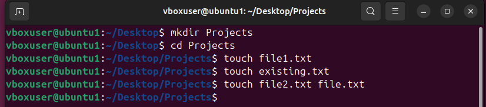
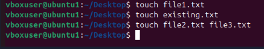
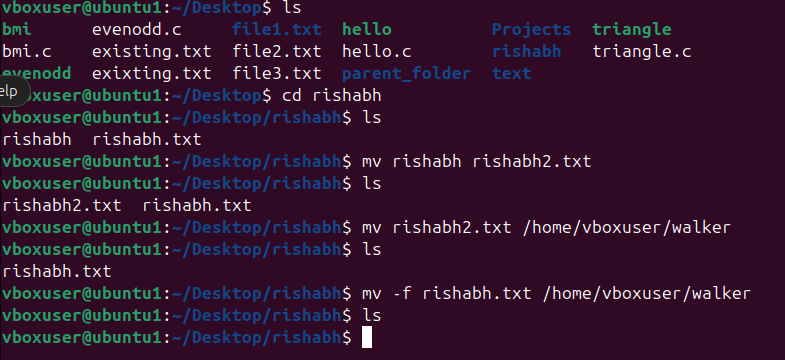
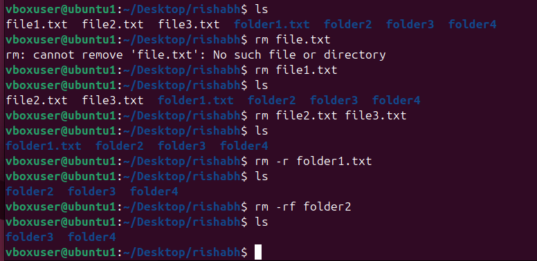

# 🐧 Advanced Linux File Commands Cheat Sheet
> A clear, visually-rich guide to mastering file manipulation, permissions, and advanced operations in Linux.


---

## 📜 Table of Contents
1. [File Manipulation Commands](#1-file-manipulation-commands)
2. [File Permissions and Ownership](#2-file-permissions-and-ownership)
3. [Advanced File and Directory Operations](#3-advanced-file-and-directory-operations)
4. [Quick Summary Cheat Sheet](#📝-summary-cheat-sheet)

---

## **1. 📂 File Manipulation Commands**

### 📄 **`touch` – Create or Update File Timestamps**
```bash
touch file1.txt                # Create an empty file
touch existing.txt              # Update timestamp of existing file
touch file2.txt file3.txt       # Create multiple files
````



*Creating and updating files in Ubuntu.*

> 💡 **Tip:** Great for quickly creating placeholder files.

---

### 📄 **`cp` – Copy Files and Directories**

```bash
cp source.txt destination.txt   # Copy a file
cp source.txt /path/to/destination/
cp -r dir1 dir2                  # Copy directory recursively
cp -p source.txt backup.txt      # Preserve attributes
```


> ⚠️ **Warning:** Overwrites files without confirmation unless `-i` is used.

---

### ✂️ **`mv` – Move or Rename Files**

```bash
mv oldname.txt newname.txt      # Rename a file
mv file.txt /path/to/destination/
mv -f file.txt /destination/    # Force move without prompt
```



---

### 🗑 **`rm` – Remove Files and Directories**

```bash
rm file.txt                     # Remove a file
rm file1.txt file2.txt          # Remove multiple files
rm -r foldername/               # Remove a directory recursively
rm -rf foldername/              # Force remove without prompt
```



> ⚠️ **Danger:** `rm -rf` permanently deletes without recovery!

---

### 📜 **`cat` – View or Concatenate Files**

```bash
cat file.txt                    # Display file contents
cat file1.txt file2.txt > combined.txt
cat -n file.txt                  # Show line numbers
```


---

### 📖 **`less` – View File One Page at a Time**

```bash
less file.txt
# Space → next page
# b → previous page
# q → quit
```


---

### 🔝 **`head` – Show First Lines of a File**

```bash
head file.txt                    # First 10 lines (default)
head -n 20 file.txt               # First 20 lines
```

---

### 🔚 **`tail` – Show Last Lines of a File**

```bash
tail file.txt                     # Last 10 lines (default)
tail -n 15 file.txt                # Last 15 lines
tail -f logfile.txt                # Monitor in real-time
```

---

## **2. 🔐 File Permissions and Ownership**

### 📋 **`ls -l` – View Detailed File Info**

```bash
ls -l
# Example output:
# -rw-r--r-- 1 user group 1024 Aug 14 10:00 file.txt
```

| Field       | Example      | Meaning                                     |
| ----------- | ------------ | ------------------------------------------- |
| Permissions | -rw-r--r--   | Read/Write for owner, read for group/others |
| Links       | 1            | Hard link count                             |
| Owner       | user         | File owner                                  |
| Group       | group        | Group owner                                 |
| Size        | 1024         | Size in bytes                               |
| Date        | Aug 14 10:00 | Last modified                               |
| Name        | file.txt     | File name                                   |

---

### 🔑 **`chmod` – Change File Permissions**

```bash
chmod u+x file.sh    # Add execute for owner
chmod g-w file.txt   # Remove write for group
chmod o+r file.txt   # Add read for others
chmod 755 file.sh    # rwxr-xr-x
chmod 644 file.txt   # rw-r--r--
```

---

### 👤 **`chown` – Change File Owner**

```bash
sudo chown newuser file.txt
sudo chown newuser:newgroup file.txt
```

---

### 👥 **`chgrp` – Change Group**

```bash
sudo chgrp developers file.txt
```

---

## **3. 🚀 Advanced File and Directory Operations**

### 🔍 **`find` – Search for Files**

```bash
find /path -name "file.txt"
find /path -name "*.log"
find /path -size +100M
find /path -name "*.tmp" -delete
```

---

### 🔎 **`grep` – Search Text in Files**

```bash
grep "error" logfile.txt
grep -i "error" logfile.txt
grep -r "TODO" /project/
grep -n "warning" logfile.txt
```

---

### 📦 **`tar` – Archive Files**

```bash
tar -cvf archive.tar file1 file2 dir/
tar -xvf archive.tar
tar -tvf archive.tar
```

---

### 🗜 **`gzip` / `gunzip` – Compress & Decompress**

```bash
gzip file.txt       # Creates file.txt.gz
gunzip file.txt.gz
```

---

### 🔗 **`ln` – Create Links**

```bash
ln original.txt hardlink.txt
ln -s /path/to/original symlinkname
```

---

## 📝 **Summary Cheat Sheet**

| Command | Purpose              | Example                     |
| ------- | -------------------- | --------------------------- |
| `touch` | Create/update files  | `touch file.txt`            |
| `cp`    | Copy files/folders   | `cp file.txt /backup/`      |
| `mv`    | Move/rename files    | `mv old.txt new.txt`        |
| `rm`    | Delete files/folders | `rm -rf folder/`            |
| `cat`   | View/merge files     | `cat file.txt`              |
| `less`  | View file (paged)    | `less file.txt`             |
| `head`  | Show first lines     | `head -n 10 file.txt`       |
| `tail`  | Show last lines      | `tail -f logfile.txt`       |
| `chmod` | Change permissions   | `chmod 755 file.sh`         |
| `chown` | Change owner         | `sudo chown user file.txt`  |
| `chgrp` | Change group         | `sudo chgrp dev file.txt`   |
| `find`  | Search for files     | `find . -name "*.log"`      |
| `grep`  | Search in files      | `grep "error" file.txt`     |
| `tar`   | Archive              | `tar -cvf archive.tar dir/` |
| `gzip`  | Compress             | `gzip file.txt`             |
| `ln`    | Create links         | `ln -s target linkname`     |

---

```

---


```