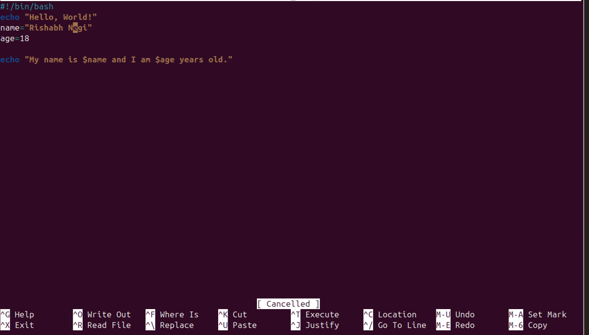

⭐Assignment 2 – Script Execution & Explanation

## Script 1: first.sh

## Purpose:

Demonstrates how to create an array in Bash.
Shows how to access individual elements and print all elements.

## Line-by-Line Explanation:

#!/bin/bash → Indicates this is a Bash script.
fruits=("apple" "banana" "cherry") → Creates an array named fruits with three elements.
echo "First fruit: ${fruits[0]}" → Prints the first element (apple).
echo "Second fruit: ${fruits[1]}" → Prints the second element (banana).
echo "All fruits: ${fruits[@]}" → Prints all elements (apple banana cherry).

## Example Run:

--------------------------------------------------------

## Script 2: personal_info.sh

## Purpose:

Demonstrates printing messages in Bash.
Shows how to use variables to store personal information.

## Line-by-Line Explanation:

#!/bin/bash → Indicates this is a Bash script.
echo "Hello, World!" → Prints a greeting message.
name="Rishabh" → Creates a variable name and assigns the value Rishabh.
age=19 → Creates a variable age and assigns the value 19.
echo "My name is $name and I am $age years old." → Prints a sentence using the variables.

## Example Run:

## Extra_Question 

1. Purpose of #!/bin/bash at the top of a script
=> This line is called a shebang.
It tells the system which interpreter to use to run the script.
#!/bin/bash specifically tells the system to run the script using Bash.
Without it, the script may not run correctly, or it may be run by a different shell (like sh), which could cause errors.

2. How to make a script executable
=> there are two ways - 
a. Open the terminal.
Use the chmod command to give execute permission. For example:
chmod +x script_name.sh

script_name.sh → Name of your script.

After that, run the script with:
./script_name.sh

b. using 
bash script_name.sh

