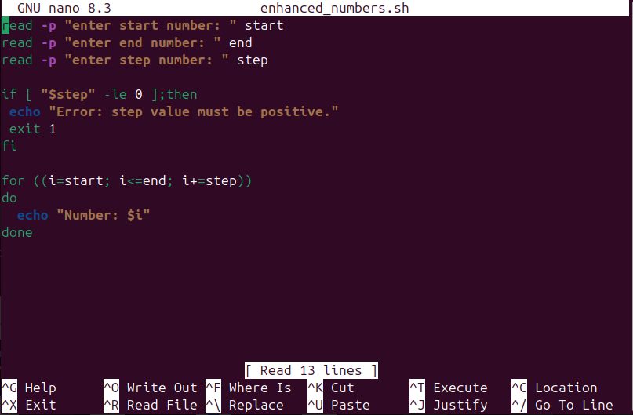

# 📝 **Assignment 3 – Modify an Existing Script**

Name-Rishabh negi

sap id-590025385

## 🎯 **Objective**
> Enhance and customize a script by adding user input and validation.

## 🚦 **Tasks Overview**
- Select a script from `Scripts/` (e.g., `print_numbers.sh`)
- Modify it so the user provides start, end, and step values as input
- Validate inputs (e.g., step must be positive)
- Save as `enhanced_numbers.sh`
- Explain original vs. new behavior and show example

- 

## question - Original vs. new behavior.

1. Input Handling

Original: Numbers 1 2 3 4 5 are fixed inside the script. User cannot change them without editing the code.

New: User is asked to enter start, end, and step values directly when running the script.

2. Flexibility

Original: Always prints the same sequence 1 → 5 with step 1.

New: Can print any sequence (e.g., 2 4 6 8 10 or 5 10 15) depending on user’s input, making it more customizable.

3. Validation

Original: No validation at all. The loop just runs as written.

New: Validates the step value to ensure it’s positive. If the user enters 0 or a negative number, the script shows an error and stops.

## question - Example run with different inputs.

## Extra_question

1. Difference between $1, $@, and $# in Bash

$1 → Refers to the first argument passed to the script.

$@ → Represents all arguments passed to the script as separate words.

$# → Gives the total number of arguments passed to the script.

2. What does exit 1 mean in a script

exit stops the script immediately.
The number after exit is the exit status ,
0 → Success
Non-zero (like 1) → Indicates an error or failure
In your script, exit 1 is used when the user enters an invalid step (=< 0) to stop execution and signal an error.
