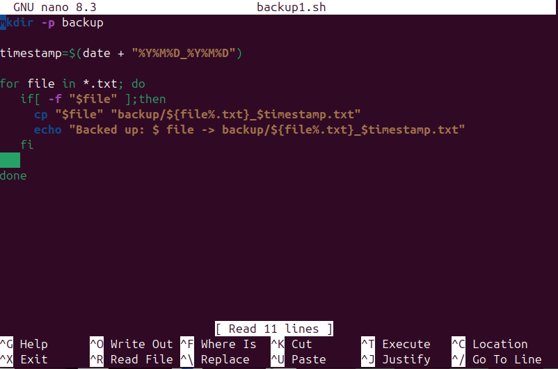

# 📝 **Assignment 4 – File & Backup Automation**

---

Name-Rishabh negi

sap id-590025385

## 🎯 **Objective**
> Automate file management by backing up `.txt` files with timestamps.

## 📝 **How the Script Works**
mkdir -p backup

1️⃣. Creates a folder named backup if it doesn’t already exist.

2️⃣. timestamp=$(date +"%Y%m%d_%H%M%S")

a. Gets the current date and time in the format YYYYMMDD_HHMMSS.

b. This timestamp is used to uniquely name the backup files.

3️⃣. for file in *.txt; do … done

a. Loops through every .txt file in the current directory.

4️⃣. if [ -f "$file" ]; then

a. Checks if the item is a regular file (not a folder).

5️⃣. cp "$file" "backup/${file%.txt}_$timestamp.txt"

a. Copies the file into the backup folder.

b. ${file%.txt} removes the .txt extension so the timestamp can be added before it.

6️⃣. echo "Backed up: $file → backup/${file%.txt}_$timestamp.txt"

a. Prints a message showing which file was backed up and its new name.

## ▶️ **Example Run**

## ❓ **Extra Questions**

### 1️⃣ What is the difference between `cp`, `mv`, and `rsync`?

-**`cp`**: Copies files or directories.

- **`mv`**: Moves or renames files or directories; original is removed from old location.

- **`rsync`**:: Synchronizes files/folders efficiently; preserves permissions, timestamps, and skips unchanged files; ideal for backups.

### 2️⃣ How can you schedule scripts to run automatically?

Use cron jobs to run scripts at specified times.
Open crontab: crontab -e
Example: 0 2 * * * /home/user/backup.sh → runs every day at 2 AM.

Alternatives:
systemd timers → modern scheduling in Linux.
at command → schedule one-time execution.
