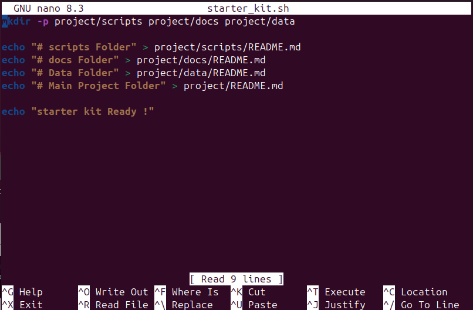

⚡Lab 5 – Starter Kit & Automation

Name-Rishabh negi

sap id-590025385

## PURPOSE OF THIS SCRIPT

The starter_kit.sh script is designed to quickly set up a basic project structure.  
It creates a project/ folder with three subdirectories:  
- scripts/ → for code and automation scripts  
- docs/ → for documentation files  
- data/ → for datasets or raw inputs  

Each folder, including the main project/ folder, gets a placeholder README.md file to explain its purpose.  
This ensures consistency and helps team members navigate the project easily.  

At the end, the script displays “Starter Kit Ready!” to confirm that the setup was completed successfully.  

## example run

## extra question - 

## question - 1 

Saves time: Repetitive tasks like setting up folders, deploying code are done automatically.

Reduces errors: Automation ensures consistency and avoids human mistakes.

Improves efficiency: Teams can focus on coding and problem-solving instead of manual setup.

Supports scalability: Automated processes can handle multiple environments or servers easily.

## question - 2

mkdir is used to create directories.

The -p option means parents

It will create parent directories automatically if they don’t exist.

It doesn’t throw an error if the directory already exists.
