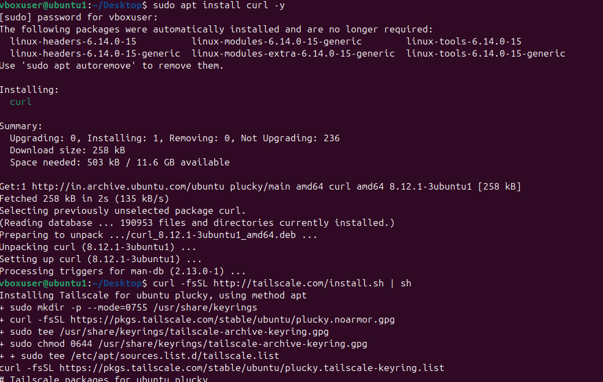
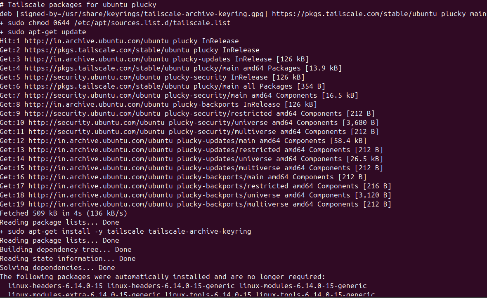
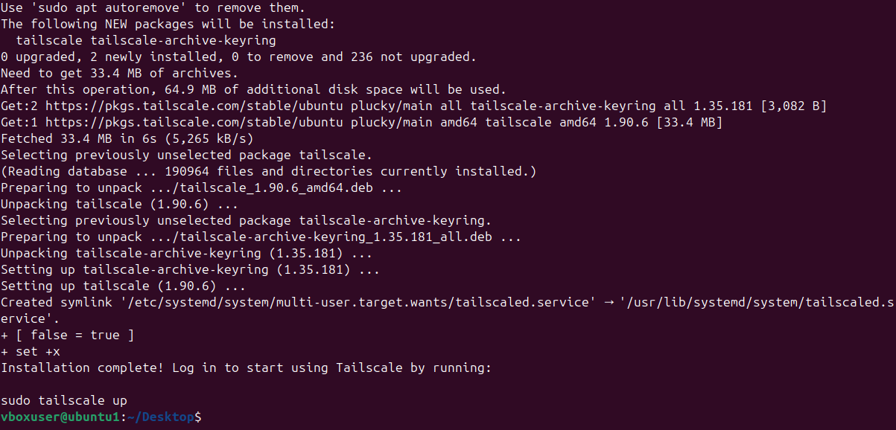
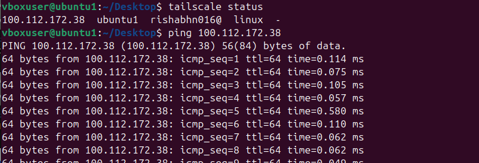

# 🐧 Linux Networking Guide  
## 🔗 Transfer Files Between Different Networks Using Tailscale (Ubuntu ↔ Ubuntu)

> A clean, secure, and modern approach to connecting Ubuntu systems across networks using *Tailscale* — powered by WireGuard encryption.

---

## 🧭 1. Introduction

*Tailscale* turns your devices into a private, encrypted network (VPN mesh).  
It makes two Ubuntu systems — even on *different networks* — communicate securely as if they were on the same LAN.

✅ No manual VPN setup  
✅ No port forwarding  
✅ No public IPs required

> *In short:* Tailscale = “Zero-config private networking.”

---

## ⚙ 2. Prerequisites

| 🧩 Requirement | Description |
|----------------|-------------|
| 💻 Two Ubuntu systems | Example: ubuntu-laptop and ubuntu-server |
| 🌐 Internet connectivity | Required on both systems |
| 🔑 Authentication | GitHub / Google / Microsoft account |
| ⚡ Privileges | sudo access on both systems |

---

## 🧰 3. Installation

Run the following *on both Ubuntu systems*:

bash
curl -fsSL https://tailscale.com/install.sh | sh
`

This command:

* Installs the official Tailscale package
* Sets up the background service tailscaled

> 💡 *Tip:* You can also install via APT for long-term environments:
>
> bash
> sudo apt install tailscale
> 

---

## 🔐 4. Starting and Logging In

Enable and log into Tailscale:

bash
sudo tailscale up


A browser tab will open — sign in using your preferred provider (GitHub, Google, etc.).
After login, your device joins your private VPN and receives an IP address like:


100.80.120.5





> 🧠 *Note:* These 100.x.x.x addresses are internal, encrypted IPs visible only to your own Tailscale-connected devices.

---

## 🌐 5. Verify Network Connection

### Check device connectivity:

bash
tailscale status


Example output:


100.80.120.5   ubuntu-laptop   linux   online
100.83.142.8   ubuntu-server   linux   online


### Test the link:

bash
ping 100.83.142.8


If the ping succeeds, the connection between systems is live and secure.



---

## 📦 6. File Transfer Methods

Tailscale supports multiple secure file transfer methods.
Choose one depending on your workflow.

---

### 🚀 Method 1 — Using SCP (Secure Copy)

Transfer files directly through the Tailscale IP.

bash
scp /home/user/file.txt ubuntu@100.83.142.8:/home/ubuntu/


To copy an entire folder:

bash
scp -r /home/user/Documents ubuntu@100.83.142.8:/home/ubuntu/Backup/


> ⚡ *Pro Tip:* Use SSH keys for passwordless transfers — it’s faster and more secure.

---

### ⚡ Method 2 — Using Rsync (Fast, Resumable)

Install rsync if not present:

bash
sudo apt install rsync


Transfer command:

bash
rsync -avz /home/user/Documents/ ubuntu@100.83.142.8:/home/ubuntu/Documents/


| Flag | Description                                  |
| ---- | -------------------------------------------- |
| -a | Archive (preserves permissions & timestamps) |
| -v | Verbose (shows progress)                     |
| -z | Compress data during transfer                |

> 💡 *Why Rsync?*
> It’s resumable, efficient, and ideal for large file sets or frequent syncs.

 


### 📨 Method 3 — Using Tailscale’s Built-In “Send File”

Tailscale includes a native feature for direct file sharing.

*Send a file:*

bash
tailscale file send /home/user/file.txt


*Receive files:*

bash
tailscale file receive


Received files appear under:


~/Downloads/Tailscale/


> 💬 Ideal for one-off transfers — no SSH or SCP setup needed.


---

## 🧩 7. Device Management

Manage your connected systems easily using the following commands:

| 🧠 Task                 | Command               | Description                    |
| ----------------------- | --------------------- | ------------------------------ |
| List all peers          | tailscale status    | Displays all connected devices |
| Show local Tailscale IP | tailscale ip -4     | Prints this system’s VPN IP    |
| Disconnect from network | sudo tailscale down | Temporarily disables Tailscale |
| Reconnect               | sudo tailscale up   | Reconnects to your network     |


---

## 🧰 8. Troubleshooting

> Common issues and quick fixes for smoother transfers:

| ❗ Problem               | 🔎 Cause                    | 🧩 Solution                                               |
| ----------------------- | --------------------------- | --------------------------------------------------------- |
| Ping fails              | Device offline or inactive  | Run tailscale status and ensure both devices are online |
| SCP “Permission denied” | Incorrect username or path  | Verify remote username and destination folder             |
| Transfer speed low      | Network congestion          | Use rsync -z for compression                            |
| Browser login fails     | Headless or SSH-only system | Use an auth key: tailscale up --authkey <key>           |

---

## 🛡 9. Security & Best Practices

### Keep Tailscale updated:

bash
sudo apt update && sudo apt upgrade tailscale


### Stop Tailscale when not in use:

bash
sudo systemctl stop tailscaled


### Control access via ACLs:

You can define Access Control Lists in your Tailscale Admin Console to restrict which devices can communicate.


> 🔒 *Best Practice:* Use ACLs and device tags to segment access between production and personal machines.

---

## 🏁 10. Summary

Tailscale offers a seamless, encrypted bridge between Ubuntu systems — even across entirely different networks.

With it, you can:

* 💾 Transfer files securely (scp, rsync, or tailscale file)
* 🌍 Access remote devices without public IPs
* 🔐 Maintain privacy and encryption by default

---

> 🧭 *In essence:* Tailscale transforms the internet into your own secure LAN.

---


```

---