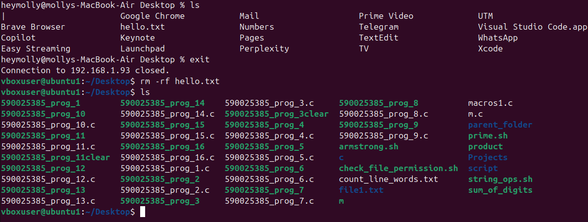

# 🐧 Linux Networking Guide  
### 🌐 Transfer or Copy Files Through the Same Network

---

## 📘 1. What is Linux Networking?

> Linux networking is a collection of kernel subsystems, user-space tools, configuration files, and services that allow a Linux system to exchange data with other systems — whether locally or over the Internet.

At runtime, Linux networking manages:
- ⚙ Moving bits between hardware and applications  
- 🧭 Addressing and routing packets  
- 🔒 Secure transfer (via TCP/SSH)  
- 🧱 Policy enforcement (firewalls, iptables/nftables)  
- 🪄 Virtualization of networks (namespaces, bridges, VLANs, etc.)

---

## 🎯 2. Why Do Networking?

Networking enables:
- 🤝 *Resource sharing:* Files, printers, databases, compute nodes  
- 💻 *Service hosting:* Web, mail, DNS, SSH, LDAP  
- 🧠 *Centralized management:* Monitoring, automation, logging  
- 🚀 *Scalability:* Load balancing, clustering, cloud orchestration  
- 🌍 *Remote access:* Admin, APIs, file transfer  
- 🛡 *Security & isolation:* Firewalls, namespaces, VLANs  
- ⚡ *Performance optimization:* Traffic shaping, QoS, offloading  

> Networking transforms isolated computers into an interconnected system that powers modern computing.

---

## 🧩 3. The Conceptual Networking Stack

| Layer | Description | Tools |
|-------|--------------|-------|
| *Physical / Link Layer* | NICs, Ethernet/Wi-Fi, MAC, ARP | ethtool, ip link |
| *Network Layer* | IPv4/IPv6, routing, subnets | ip addr, ip route, ip neigh |
| *Transport Layer* | TCP (reliable), UDP (fast) | ss, netstat, tcpdump |
| *Socket API & Kernel* | App ↔ Kernel interface, buffering | socket, netfilter |
| *Application Layer* | Services (HTTP, SSH, DNS, NFS) | - |
| *Management Layer* | NetworkManager, DHCP, systemd-networkd | - |

---

## ⚙ 4. Basic Network Configuration

### 🔍 View IP Configuration
bash
hostname -I
`


---

# 🔐 SSH (Secure Shell)

### 🧩 Install and Start SSH

bash
sudo apt install openssh-server
sudo systemctl enable ssh
sudo systemctl start ssh


### 🩺 Check SSH Status

bash
sudo systemctl status ssh


### 💻 Connect to Remote System

bash
ssh username@192.168.1.5


### 📦 Copy Files with SCP

bash
scp file.txt username@192.168.1.5:/home/username/


### 📁 Copy a Directory

bash
scp -r myfolder username@192.168.1.5:/home/username/


### 🔑 Copy SSH Key

bash
ssh-copy-id username@192.168.1.5


---

## 📂 FTP (File Transfer Protocol)

### 🧰 Install and Start FTP Server

bash
sudo apt install vsftpd
sudo systemctl enable vsftpd
sudo systemctl start vsftpd


### 📡 Check FTP Status

bash
sudo systemctl status vsftpd


### 🌐 Connect to FTP Server

bash
ftp 192.168.1.5


*Login Example:*


Name (192.168.1.5:yourusername): ftpuser  
Password: ********


📸 Screenshot Example:


### 🧠 Basic FTP Commands

bash
ls           # List files
cd folder    # Change directory
get file.txt # Download file
put file.txt # Upload file
mget *       # Download multiple files
bye          # Exit FTP


*Configuration File:*
/etc/vsftpd.conf

---

## 👥 User & Group Access Management

| Action                      | Command                                               |
| --------------------------- | ----------------------------------------------------- |
| ➕ Create User               | sudo adduser username                               |
| ❌ Delete User               | sudo deluser username                               |
| 👥 Create Group             | sudo groupadd developers                            |
| ➕ Add User to Group         | sudo usermod -aG developers username                |
| 🔍 View Groups              | groups username                                     |
| 🧾 Change File Owner        | sudo chown username filename                        |
| 🧑‍🤝‍🧑 Change Group Owner | sudo chgrp developers filename                      |
| 🔐 Change Permissions       | chmod 755 filename                                  |
| 📜 View Permissions         | ls -l                                               |
| 🔁 Switch User              | su - username                                       |
| 🔒 Lock / Unlock User       | sudo passwd -l username / sudo passwd -u username |

---

## 🧠 Quick Command Summary

| Command         | Description        |
| --------------- | ------------------ |
| ip addr       | Show IP address    |
| ping          | Test connectivity  |
| ssh user@host | Remote login       |
| scp           | Secure file copy   |
| ftp           | Connect to FTP     |
| adduser       | Create new user    |
| groupadd      | Create new group   |
| chmod         | Change permissions |
| chown         | Change ownership   |


---

## 📦 File Transfer Between Systems

### 🔹 Method 1 — Using SCP

bash
scp [source_file] [username]@[destination_IP]:[destination_path]


*Example:*

bash
scp /home/user/Documents/test.txt ubuntu@192.168.1.15:/home/ubuntu/Desktop/


✅ The file test.txt will be copied to /home/ubuntu/Desktop/ on System B.

---

### 🔹 Method 2 — Copying Folders

bash
scp -r /home/user/myfolder ubuntu@192.168.1.15:/home/ubuntu/Documents/


---

### 🔹 Method 3 — Using rsync (Faster)

bash
sudo apt install rsync
rsync -avz /home/user/Documents/ ubuntu@192.168.1.15:/home/ubuntu/Backup/


Flags:

* -a → Archive mode
* -v → Verbose
* -z → Compression

📸 Screenshot:
 


---

## 🗑 Deleting Files Remotely

### Option 1 — SSH into the Second System

bash
ssh ubuntu@192.168.1.15
cd /home/ubuntu/Desktop
rm test.txt
exit


### Option 2 — Delete Directly from Source

bash
ssh ubuntu@192.168.1.15 "rm /home/ubuntu/Desktop/test.txt"


🧹 To Delete a Folder:

bash
ssh ubuntu@192.168.1.15 "rm -r /home/ubuntu/Desktop/foldername"


📸 Screenshot:


---

## 🏁 Conclusion

> With Linux networking tools like SSH, SCP, and FTP, you can easily transfer, manage, and secure files across systems — empowering automation, collaboration, and control in any networked environment.

---

*✨ Tip:* Always verify IP addresses, permissions, and connectivity before file transfer to prevent errors or unauthorized access.

---

```