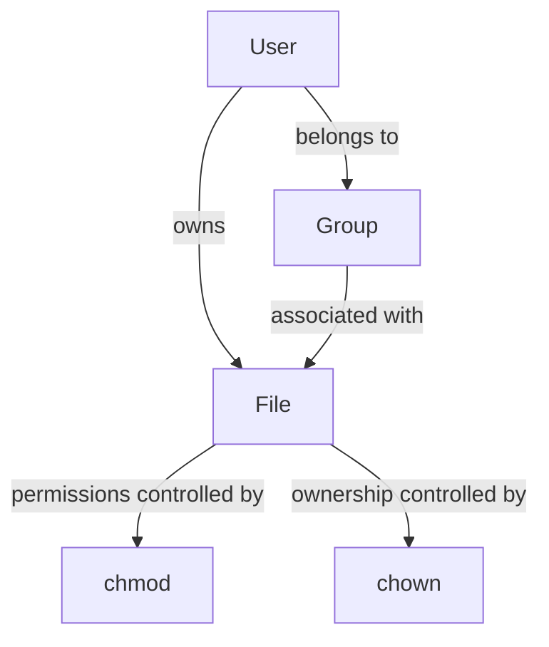

````markdown
# 🐚 Shell Tutorial – Mastering File Permissions with `chmod` and `chown`

---

## 🌟 Why Learn File Permissions?
In Linux, **file permissions** are the first layer of security. They decide **who** can *read, write, or execute* a file. Mastering this makes you more confident in handling files, scripts, and projects. 🚀

---

## 🔹 1. Understanding File Permissions in Linux

Every file/directory has three categories of users:

- 👤 **Owner** → The user who created the file.
- 👥 **Group** → A group of users who share access.
- 🌍 **Others** → Everyone else.

### Permission Types
- **r (read)** → View file contents (**4**)
- **w (write)** → Modify file contents (**2**)
- **x (execute)** → Run file/script (**1**)

👉 Each permission is represented as a **number**: `r=4`, `w=2`, `x=1`.

---

### 📂 Permission Layout Example
Command:
```bash
ls -l file.txt
````

Output:

```
-rwxr-xr--
```

Breakdown:

* `-` → Regular file (`d` = directory, `l` = link)
* `rwx` → Owner = read, write, execute
* `r-x` → Group = read, execute
* `r--` → Others = read only

---

## 🔹 2. `chmod` – Change File Permissions

### ⚙️ Syntax

```bash
chmod [options] mode filename
```

Modes can be set in **numeric (octal)** or **symbolic** form.

---

### (A) Numeric (Octal) Method

Each digit is a sum of permissions:

* `7 = rwx`
* `6 = rw-`
* `5 = r-x`
* `4 = r--`
* `0 = ---`

✅ Example:

```bash
chmod 755 script.sh
```

Meaning:

* Owner → `rwx`
* Group → `r-x`
* Others → `r-x`

📊 Visualization:

```
7 5 5
rwx r-x r-x
```

---

### (B) Symbolic Method

Use letters + operators:

* `u` (user/owner), `g` (group), `o` (others), `a` (all)
* `+` (add), `-` (remove), `=` (set exact)

✅ Examples:

```bash
chmod u+x script.sh     # Add execute for owner
chmod g-w notes.txt     # Remove write from group
chmod o=r file.txt      # Set others to read only
chmod a+r report.txt    # Everyone gets read access
```

---

### (C) Recursive Changes

Apply changes to all files/subfolders:

```bash
chmod -R 755 mydir/
```

---

## 🔹 3. `chown` – Change File Ownership

### ⚙️ Syntax

```bash
chown [options] new_owner:new_group filename
```

✅ Examples:

```bash
chown rishabh file.txt           # Change owner to rishabh
chown rishabh:dev file.txt       # Change owner to rishabh, group to dev
chown :dev file.txt            # Change only group to dev
chown -R rishabh:dev /project    # Recursive ownership change
```
## 📊 Ownership Flow (Mermaid Diagram)


## 📊 Command Summary

| Command                 | Description                        |
| ----------------------- | ---------------------------------- |
| `ls -l`                 | View file permissions & ownership  |
| `chmod u+x file`        | Add execute permission for user    |
| `chmod g-w file`        | Remove write permission for group  |
| `chmod 754 file`        | Set permissions using octal values |
| `chown user file`       | Change file owner                  |
| `chown user:group file` | Change file owner and group        |

---
---

## 🔹 4. Putting It All Together

```bash
touch project.sh
ls -l project.sh
```

Output:

```
-rw-r--r-- 1 rishabh dev 0 Aug 19 12:00 project.sh
```

Now:

```bash
chmod 700 project.sh       # Owner = rwx, no access to others
chmod u+x,g-w project.sh   # Add execute to owner, remove write for group
chown root:admin project.sh # Change owner to root, group to admin
```

---

## 🔹 5. Quick Reference Cheat Sheet 📑

| Numeric | Permission | Meaning         |
| ------- | ---------- | --------------- |
| 0       | ---        | No access       |
| 1       | --x        | Execute only    |
| 2       | -w-        | Write only      |
| 3       | -wx        | Write + Execute |
| 4       | r--        | Read only       |
| 5       | r-x        | Read + Execute  |
| 6       | rw-        | Read + Write    |
| 7       | rwx        | Full access     |

---

✅ **Pro Tip:** Use **numeric mode** for quick settings (e.g., `755`, `644`) and **symbolic mode** for fine-tuning (`u+x`, `g-w`).

✨ With `chmod` + `chown`, you’re now in full control of your Linux files! 🎉

```
```
