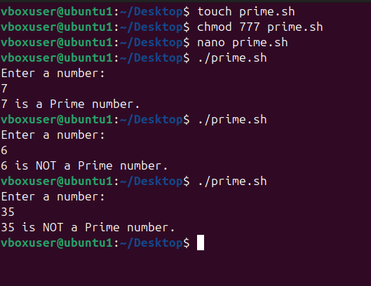

# **Experiment: Prime Number Program in Shell Script**

## **Objective**
To write and execute a shell script that checks whether a given number is a **prime number** or not.

## **Theory**
- A **prime number** is a number that is divisible only by **1 and itself**.  
- First few prime numbers: 2, 3, 5, 7, 11, 13, 17…  
- Numbers less than 2 are **not prime**.  

### Conditions:
1. If `n ≤ 1` → Not prime  
2. If `n` has any divisor other than 1 and itself → Not prime  
3. Else → Prime  

## Algorithm
1. Read a number from the user.  
2. If the number is less than 2 → not prime.  
3. Loop from `2` to `n/2`:  
   - If divisible, mark as not prime.  
4. If no divisors are found → prime.  

## Shell Script Code (`prime.sh`)

```sh
#!/bin/bash

# Read a number
echo "Enter a number: "
read num

# Prime check
if [ $num -le 1 ]
then
    echo "$num is NOT a prime number."
    exit
fi

i=2
is_prime=1

while [ $i -le $((num / 2)) ]
do
    if [ $((num % i)) -eq 0 ]
    then
        is_prime=0
        break
    fi
    i=$((i + 1))
done

if [ $is_prime -eq 1 ]
then
    echo "$num is a Prime number."
else
    echo "$num is NOT a Prime number."
fi
```

# **image**
