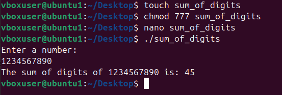

# Experiment: Sum of Digits Program in Shell Script

## Objective
To write and execute a shell script that calculates the **sum of digits** of a given number.

## Theory
- The **sum of digits** of a number is obtained by repeatedly extracting the last digit and adding it to a running total.  
- Example:  

## Algorithm
1. Read a number from the user.  
2. Initialize `sum = 0`.  
3. Repeat until the number becomes 0:  
 - Extract last digit using modulus (`num % 10`).  
 - Add it to `sum`.  
 - Remove last digit by division (`num / 10`).  
4. Print the final sum.  

## Shell Script Code (`sum_digits.sh`)

```sh
#!/bin/bash

# Read a number
echo "Enter a number: "
read num

sum=0
original=$num

# Loop until number becomes 0
while [ $num -gt 0 ]
do
  digit=$(( num % 10 ))
  sum=$(( sum + digit ))
  num=$(( num / 10 ))
done

echo "The sum of digits of $original is: $sum"
```

# **image**
