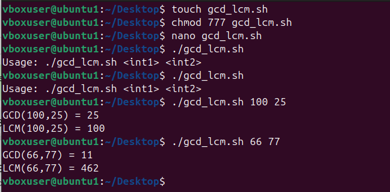

# **Experiment: GCD and LCM using Shell Script**

## **Aim**
To write a shell script that calculates the **Greatest Common Divisor (GCD)** and **Least Common Multiple (LCM)** of two numbers.

## Algorithm
1. Read two numbers from the user.
2. Use the **Euclidean Algorithm** to compute the GCD:
   - Repeat dividing and taking remainder until remainder becomes 0.
   - The last divisor is the GCD.
3. Compute LCM using the relation:  
   \[
   \text{LCM}(a, b) = \frac{a \times b}{\text{GCD}(a, b)}
   \]
4. Display GCD and LCM.

## Program
```bash
#!/bin/bash
# gcd_lcm.sh
# Usage: ./gcd_lcm.sh 24 36

if [ $# -ne 2 ]; then
  echo "Usage: $0 <int1> <int2>"
  exit 1
fi

a=$1; b=$2
if ! [[ $a =~ ^[0-9]+$ ]] || ! [[ $b =~ ^[0-9]+$ ]]; then
  echo "Both arguments must be non-negative integers."
  exit 1
fi

# GCD using Euclidean algorithm
gcd() {
  x=$1; y=$2
  while [ "$y" -ne 0 ]; do
    t=$(( x % y ))
    x=$y
    y=$t
  done
  echo "$x"
}

g=$(gcd "$a" "$b")
if [ "$g" -eq 0 ]; then
  lcm=0
else
  lcm=$(( (a / g) * b ))
fi

echo "GCD($a,$b) = $g"
echo "LCM($a,$b) = $lcm"
```

# **image**
