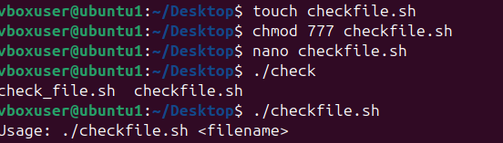

# **Experiment: File Existence Check Script in Shell**

## Objective**
To write a shell script that checks if a given file exists, displays its contents if present, or asks the user if they want to create it if absent.

## **Requirements**
- Linux/Unix system with bash shell
- Basic knowledge of shell scripting
- A text editor (e.g., `nano`, `vim`, or `gedit`)

## **Script**
Create a file named `check_file.sh` and add the following code:

```sh
#!/bin/bash
# check_file.sh
# Usage: ./check_file.sh filename.txt

if [ $# -ne 1 ]; then
  echo "Usage: $0 <filename>"
  exit 1
fi

file="$1"
if [ -e "$file" ]; then
  echo "File exists: $file"
  echo "------ contents ------"
  cat -- "$file"
else
  echo "File '$file' does not exist."
  read -p "Create it now? (y/N): " ans
  case "$ans" in
    [Yy]*) touch "$file"; echo "Created $file"; echo "You can edit it using your favorite editor." ;;
    *) echo "Not creating file." ;;
  esac
fi
```
# **-output and image for the code**
