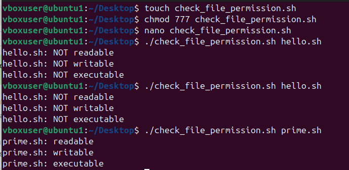

# **Experiment: File Permission Checker in Shell Script**

## **Objective**
To create a shell script that checks whether a given file is **readable**, **writable**, or **executable**.

## **Aim**
The aim of this experiment is to understand how to use conditional expressions in shell scripting to check file permissions.

## **Requirements**
- Linux/Unix environment  
- Shell (bash)  
- A file to test permissions on  

## **Algorithm**
1. Start the script with the shebang `#!/bin/bash`.  
2. Check if exactly one argument (filename) is provided.  
   - If not, display usage instructions and exit.  
3. Store the filename in a variable.  
4. Use conditional tests:  
   - `-r` to check readability.  
   - `-w` to check writability.  
   - `-x` to check executability.  
5. Print the results accordingly.  

## **Program Code**
```sh
#!/bin/bash
# check_perms.sh
# Usage: ./check_perms.sh filename

if [ $# -ne 1 ]; then
  echo "Usage: $0 <filename>"
  exit 1
fi

file="$1"
[ -r "$file" ] && echo "$file: readable" || echo "$file: NOT readable"
[ -w "$file" ] && echo "$file: writable" || echo "$file: NOT writable"
[ -x "$file" ] && echo "$file: executable" || echo "$file: NOT executable"
```
## **Image for the output**

---