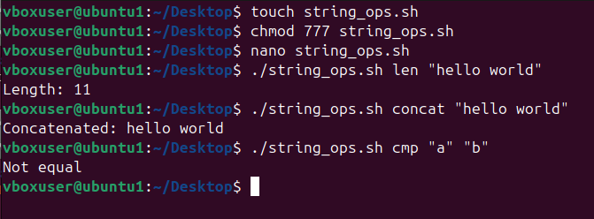

# **Experiment: String Operations in Shell Script**

## **Objective**
To write a shell script that performs basic string operations such as:
1. Finding the length of a string  
2. Concatenating multiple strings  
3. Comparing two strings  

---

## **Script**
```sh
#!/bin/bash
# string_ops.sh
# Usage examples:
# ./string_ops.sh len "hello world"
# ./string_ops.sh concat "hello" "world"
# ./string_ops.sh cmp "a" "b"

op="$1"; shift
case "$op" in
  len)
    s="$*"
    echo "Length: ${#s}"
    ;;
  concat)
    echo "Concatenated: $*"
    ;;
  cmp)
    a="$1"; b="$2"
    if [ "$a" = "$b" ]; then echo "Equal"; else echo "Not equal"; fi
    ;;
  *)
    echo "Usage: $0 {len|concat|cmp} args..."
    ;;
esac
```
## **image for the output**
